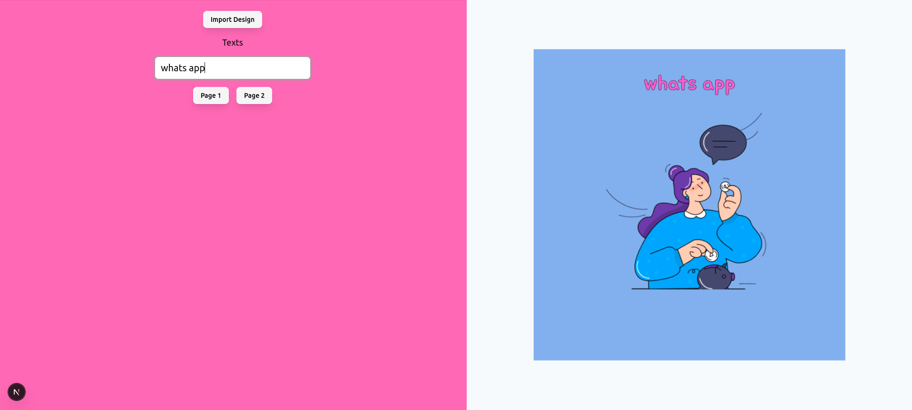

# FabricJS Previewer (Next.js Demo)

A minimal **previewer for FabricJS-based designs** built with **Next.js (App Router)**.  
It lets you **import a JSON template**, **preview each page**, and **update text content** on the fly — replicating how a production editor would render and tweak templates, without exposing the full editor UI.



## Features

- 📄 **Import Fabric JSON templates** (multi-page supported)
- 👀 **Live preview** of each page
- ✏️ **Inline text editing** (update text fields and see changes immediately)
- ⚛️ **Client‑only canvas** with safe dynamic imports for FabricJS & browser‑only libs
- 🧱 **Next.js** app structure for easy integration and deployment

## Getting Started

### Prerequisites
- Node.js 18+
- pnpm / yarn / npm

### Install & Run

```bash
# install deps
pnpm install

# start dev server
pnpm dev

# open in browser
# http://localhost:3000
```

## Usage

1. **Import Design**: Load a Fabric JSON template.
2. **Navigate Pages**: Use page buttons to switch between template pages.
3. **Edit Text**: Change text inputs; the preview updates in real time.

## Tech Notes

- The canvas component is **client‑only** to avoid SSR issues (`dynamic(..., { ssr: false })` and `'use client'`).
- Browser‑only dependencies (like `fabric` and `paper`) are **dynamically imported inside effects**.
- No server state is required; all rendering happens on the client.

## Stack

- **Next.js** (App Router)
- **React 18**
- **FabricJS** (v6 beta)
- Optional: **Paper.js**/**opentype.js** for vector/text helpers

## Folder Hints (example)

```
app/
  page.tsx           # Demo UI (left controls, right preview)
  layout.tsx         # Root layout
components/
  Canvas.tsx         # Client-only Fabric canvas previewer
public/
  # static assets here
```

## License

MIT
